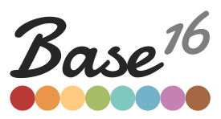
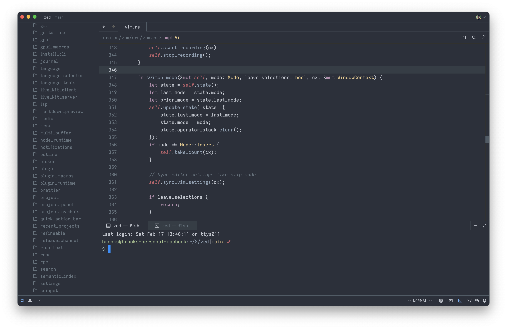

# 

A port of the base16 color schemes designed by Chris Kempson for the Zed editor.
The themes are generated based on schemes sourced from the [tinted-theming organization](https://github.com/tinted-theming/home).

## Generating Themes

To generate themes, you need to have `tinted-builder-rust` installed. You can install it using one of the following methods:

1. Using Cargo:
   ```
   cargo install tinted-builder-rust
   ```

2. Using Homebrew:
   ```
   brew tap tinted-theming/tinted
   brew install tinted-builder-rust
   ```

3. Download the binary from the [releases page](https://github.com/tinted-theming/tinted-builder-rust/releases).

Once installed, run the `generate_themes.sh` script to populate the `themes` directory.

## Custom Themes

To create a custom theme:

1. Run the `generate_themes.sh` script to populate the `themes` directory.
2. Manually tweak the desired theme file.
3. Add `_custom` to the theme name (for example `base16-ocean_custom.json`).

When regenerating themes with the `generate_themes.sh` script, custom themes will not be overwritten, and the default variant will be removed to avoid duplicates.

## base16-ocean



## base16-black-metal-bathory


